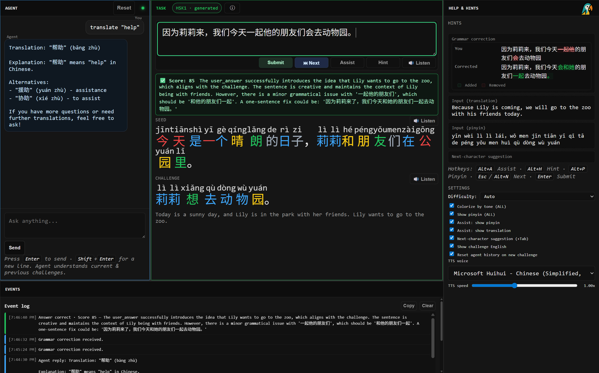

# CAATUU

Chinese learning Web App

Here is how it looks in the browser: 




# Replication instructions

### Start the container
```cmd
docker run --name caatuu --gpus all -it -p 9172:9172 -v $PWD//:/caatuu debian:latest
```

### Instlal everything
```bash
apt-get update
apt-get install -y --no-install-recommends curl
apt-get install -y --no-install-recommends ca-certificates
apt-get install -y --no-install-recommends git
apt-get install -y --no-install-recommends unzip
apt-get install -y --no-install-recommends wget
apt-get install -y --no-install-recommends pkg-config
apt-get install -y --no-install-recommends libssl-dev
apt-get install -y --no-install-recommends build-essential
apt-get install -y --no-install-recommends clang
apt-get install -y --no-install-recommends locales
apt-get install -y --no-install-recommends gpg
```

### Install rust
```bash
curl https://sh.rustup.rs -sSf | sh -s -- -y --default-toolchain stable
source $HOME/.cargo/env
rustc --version
cargo --version
```

### Install ngrok (optional)

```bash
# 2) Add ngrok’s signing key (once)
curl -s https://ngrok-agent.s3.amazonaws.com/ngrok.asc | tee /etc/apt/trusted.gpg.d/ngrok.asc >/dev/null
echo "deb https://ngrok-agent.s3.amazonaws.com bookworm main" > /etc/apt/sources.list.d/ngrok.list
apt-get update
apt-get install -y --no-install-recommends ngrok

nohup ngrok http 9172 --host-header=rewrite > ngrok.log 2>&1 &
curl --silent http://127.0.0.1:4040/api/tunnels
```

### Install Cloudflared (optional)

Cloudflared is used to expose the Caatuu server to the internet via a secure
Cloudflare Tunnel (no open ports, no public IP required).

This step is optional.
If you only need local access, you can skip it.

---

#### Install cloudflared (Debian / Ubuntu / Docker)

```bash
# create keyring path
mkdir -p /usr/share/keyrings

# add Cloudflare GPG key
curl -fsSL https://pkg.cloudflare.com/cloudflare-main.gpg \
  -o /usr/share/keyrings/cloudflare-main.gpg

# add Cloudflare apt repository
echo 'deb [signed-by=/usr/share/keyrings/cloudflare-main.gpg] \
https://pkg.cloudflare.com/cloudflared any main' \
> /etc/apt/sources.list.d/cloudflared.list

# install
apt-get update && apt-get install -y cloudflared
```

---

#### One-time Cloudflare setup (only once per machine)

If this machine has never used Cloudflare Tunnel before, run:

```bash
cloudflared login
```

This command prints a URL.
Open it in a browser, log into Cloudflare, and select your domain.
This step only authenticates the machine and does not start a tunnel.

---

#### Tunnel creation (only once per project)

Create the tunnel in your Cloudflare account:

```bash
cloudflared tunnel create caatuu
```

This registers a tunnel named `caatuu` in Cloudflare.

---

#### Running the tunnel (automatic in this project)

You do not need to run:

```bash
cloudflared tunnel run caatuu
```

manually.

Caatuu uses token-based tunnel startup, which is:
- more reliable in Docker
- independent of local credential files
- automatically started by run.sh if configured

To enable the tunnel, place the token in env.local.sh:

```bash
export CLOUDFLARED_TOKEN="PASTE_TUNNEL_TOKEN_HERE"
```

On startup:
- If the token is present, the tunnel starts automatically
- If the token is missing, Caatuu runs locally without Cloudflare
