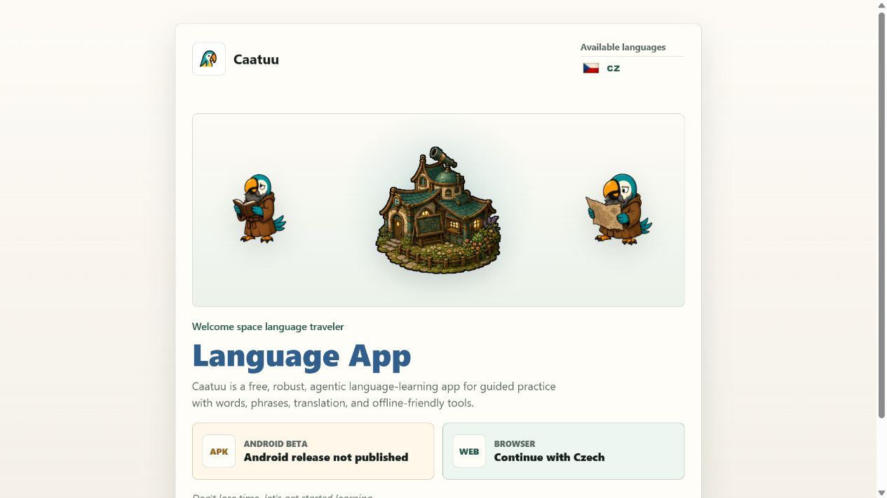
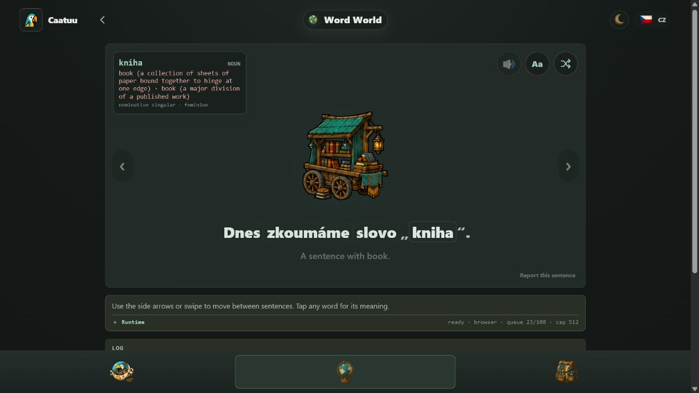
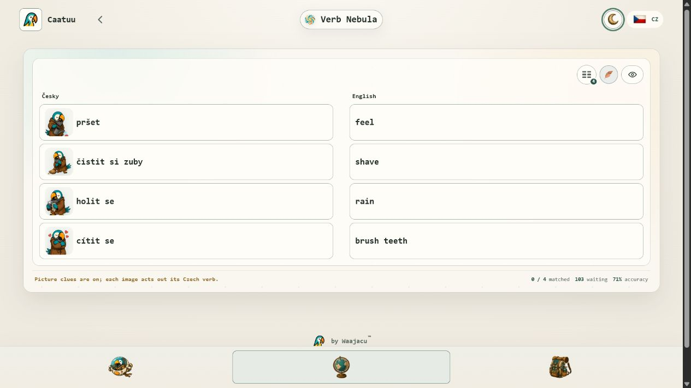

# Caatuu

> **Learn a language by entering its world.**

Caatuu is a local-first, open-source language-learning platform built around
playful interactive worlds. It brings together stories, games, dictionaries,
language models, and memorable characters so practice feels like exploration
rather than another worksheet.

The vision is bigger than any single course: **one welcoming universe where
any language can have its own world, personality, and way of teaching.**

## Language learning should feel alive

Caatuu is designed for curiosity. Discover words in context, connect them to
images and meaning, practise grammar through play, and build familiarity by
returning to places and characters you remember.

- Explore vocabulary through illustrated scenes and generated sentences.
- Turn meaning, recall, and grammar into interactive games.
- Use dictionaries, retrieval, and offline-friendly intelligence together.
- Learn on the web or continue through the native Android experience.

## Inside the experience

<table>
  <tr>
    <td width="50%">
      
    </td>
    <td width="50%">
      
    </td>
  </tr>
  <tr>
    <td align="center"><strong>Word World</strong> Explore sentences, images, and meaning.</td>
    <td align="center"><strong>Verb Nebula</strong> Learn grammar by making connections.</td>
  </tr>
</table>

## Any language, one universe

Caatuu is not a Czech-only or Chinese-only application. Languages have real
differences, so each course can bring its own writing system, grammar,
dictionaries, models, stories, and learning activities without rebuilding the
whole product.

Czech is the first active reference course and the experience shown in these
screenshots. Earlier Chinese work is preserved as part of the project's
history. More languages can join as complete worlds of their own.

## Built openly

Caatuu is an active development preview growing in public. You are welcome to
explore the code, follow its progress, and learn from the project. External
contributions are temporarily paused while the core product and collaboration
process settle; the contribution guide records the current policy.

- [See how Caatuu is designed](docs/ARCHITECTURE.md)
- [Read the language-app vision](docs/LANGUAGE_APP_CONTRACT.md)
- [Set up a development environment](docs/DEVELOPMENT.md)
- [Read the contribution policy](.github/CONTRIBUTING.md)

First-party software and developer documentation are licensed
[`AGPL-3.0-only`](LICENSE). Models, dictionaries, datasets, artwork, branding,
and third-party components may have separate terms; see
[licensing and attribution](docs/LICENSING.md).
