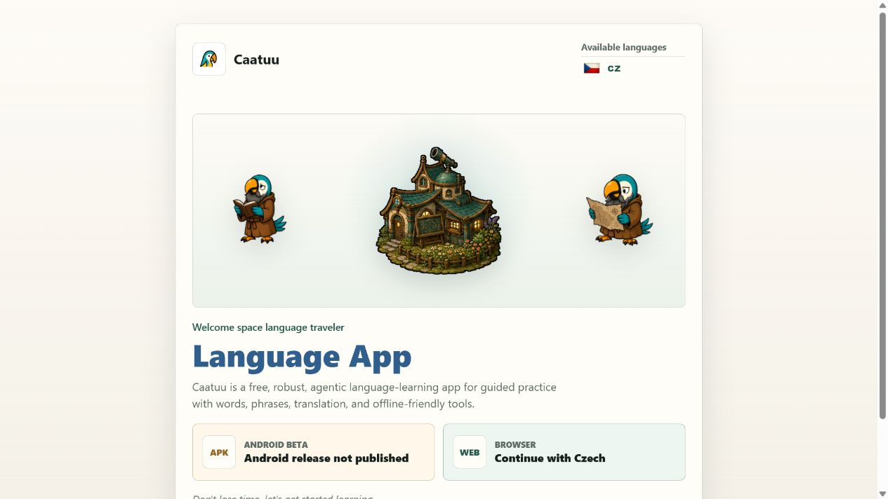
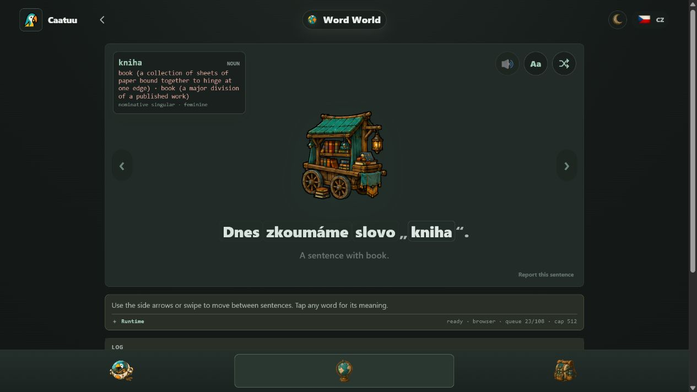
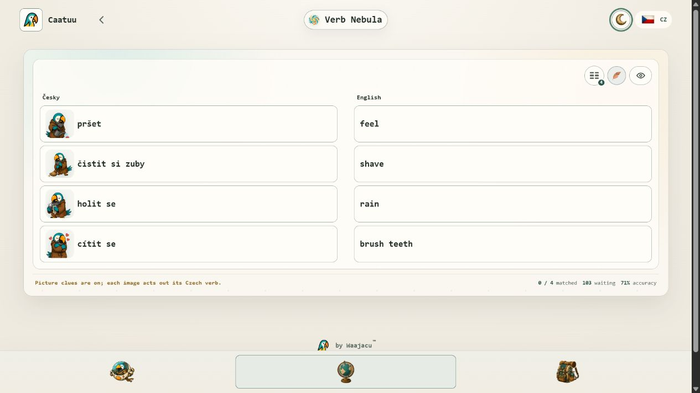

# Caatuu

> **Learn a language by entering its world.**

[](https://github.com/savethebeesandseeds/caatuu/actions/workflows/repository-ci.yml)
[](LICENSE)

Caatuu is a local-first, open-source language-learning platform built around
playful interactive worlds. It brings together stories, games, dictionaries,
language models, and memorable characters so practice feels like exploration
rather than another worksheet.

The vision is bigger than any single course: **one welcoming universe where
every language follows the same learning journey while keeping its own voice,
personality, and natural way of expressing it.**



## Language learning should feel alive

Caatuu is designed for curiosity. Discover words in context, connect them to
images and meaning, practise grammar through play, and build familiarity by
returning to places and characters you remember.

- Explore vocabulary through illustrated scenes and generated sentences.
- Turn meaning, recall, and grammar into interactive games.
- Use dictionaries, retrieval, and offline-friendly intelligence together.
- Learn on the web and, when a course manifest enables it, continue through the
  native Android experience.

## Inside the experience

<table>
  <tr>
    <td width="50%">
      
    </td>
    <td width="50%">
      
    </td>
  </tr>
  <tr>
    <td align="center"><strong>Word World</strong><br>Explore sentences, images, and meaning.</td>
    <td align="center"><strong>Verb Nebula</strong><br>Learn grammar by making connections.</td>
  </tr>
</table>

## Any language, one universe

Caatuu is not a Czech-only or Chinese-only application. One canonical
application, layout, and game engine serves every course. Each language pack
owns its reviewed learning content and may expose a different declared set of
games and linguistic features, but it supplies them through the same manifest,
adapter, content, and capability contracts instead of forking the app. English
remains the immutable per-item audit and retrieval authority even when neither
the learner base nor the target language is English.

Czech is the first active reference course and the experience shown in these
screenshots. Mandarin is the currently deployed unlisted, `noindex` development
preview at `/zh/`. English-to-Spanish (`es-ES`) is browser-enabled in the local
catalog at `/es/`, using the same shared Verb Nebula and Word World experiences,
but is withheld from Pages and Android while its native-language and
release-license reviews remain pending. Both modern courses use the shared
English concept authority and their own target-language realizations. Earlier
Chinese work remains preserved as history and is not a dependency of the
current Mandarin course. More languages can join through the same manifest,
adapter, content, and capability contracts.

## Replicate the development environment

Run these commands from the repository root in PowerShell. They create the one
durable local development container directly from a fresh `debian:latest`,
mount this checkout at `/workspace`, and reserve the loopback-only development
address `http://127.0.0.1:8765/`:

```powershell
$caatuuRoot = (Resolve-Path .).Path

docker run --detach --interactive --tty `
  --pull always `
  --name caatuu-dev `
  --hostname caatuu-dev `
  --init `
  --restart no `
  --workdir /workspace `
  --publish 127.0.0.1:8765:9172 `
  --mount "type=bind,source=$caatuuRoot,target=/workspace" `
  --env CAATUU_WORKSPACE_ROOT=/workspace `
  --env BIND_ADDR=0.0.0.0 `
  --env PORT=9172 `
  --env RUST_LOG=info `
  --env ENABLE_ANDROID_DEBUG_DOWNLOADS=0 `
  --env ENABLE_BUG_REPORTS=0 `
  --env ENABLE_CAATUU_GAME_PREVIEW=1 `
  --env DICTIONARY_GAP_STORE_PATH=/workspace/artifacts/dictionary-gaps/czech-missing-words.v1.json `
  --env VIRTUAL_ENV=/opt/caatuu-ml `
  --env JAVA_HOME=/opt/jdk-17 `
  --env ANDROID_SDK_ROOT=/opt/android-sdk `
  --env ANDROID_HOME=/opt/android-sdk `
  --env GRADLE_HOME=/opt/gradle/gradle-8.14.3 `
  --env CARGO_HOME=/root/.cargo `
  --env RUSTUP_HOME=/root/.rustup `
  --env "PATH=/opt/caatuu-ml/bin:/opt/jdk-17/bin:/opt/android-sdk/cmdline-tools/latest/bin:/opt/android-sdk/platform-tools:/opt/gradle/gradle-8.14.3/bin:/root/.cargo/bin:/usr/local/sbin:/usr/local/bin:/usr/sbin:/usr/bin:/sbin:/bin" `
  --env HF_HOME=/workspace/tools/czech-ml/data/models/english-base/hf-cache `
  --env HF_HUB_ENABLE_HF_TRANSFER=1 `
  --env HF_XET_HIGH_PERFORMANCE=1 `
  --env PYTHONUNBUFFERED=1 `
  --env QT_QPA_PLATFORM=offscreen `
  --env CAATUU_REQUIRE_NVIDIA=0 `
  debian:latest `
  sleep infinity

docker exec --workdir /workspace caatuu-dev bash ./setup.sh
```

`setup.sh` is idempotent, so rerun it whenever its tracked inputs change. The
initial setup installs the development toolchains, including the pinned Android
SDK and Gradle distribution, into the durable container's writable layer. It
intentionally does not build, test, or start Caatuu. The published port remains
idle until the local server is started in a later development step.

For normal use after the container has been created:

```powershell
docker start caatuu-dev
docker exec --interactive --tty --workdir /workspace caatuu-dev bash --login
```

If `docker run` reports that `caatuu-dev` already exists, use `docker start`;
do not replace the existing environment merely to enter it.

## Built openly

Caatuu is an active development preview growing in public. You are welcome to
explore the code, follow its progress, and learn from the project. External
contributions are temporarily paused while the core product and collaboration
process settle; the contribution guide records the current policy.

- [See how Caatuu is designed](docs/ARCHITECTURE.md)
- [Read the language-app vision](docs/LANGUAGE_APP_CONTRACT.md)
- [Set up a development environment](docs/DEVELOPMENT.md)
- [Read the contribution policy](.github/CONTRIBUTING.md)

First-party software, developer documentation, and Caatuu-authored English and
Mandarin curriculum content are licensed [`AGPL-3.0-only`](LICENSE).
The Spanish development curriculum is outside that cleared curriculum statement
while its manifest remains `release-review-required`.
Third-party or separately licensed models, dictionaries, datasets, artwork,
branding, and components may have separate terms; see
[licensing and attribution](docs/LICENSING.md).
