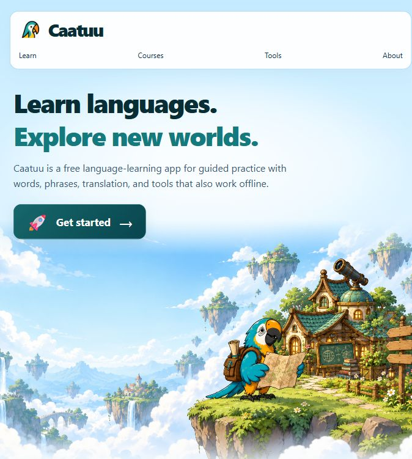
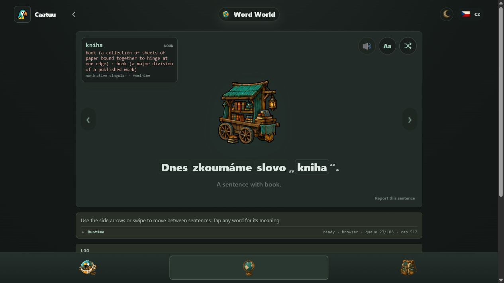
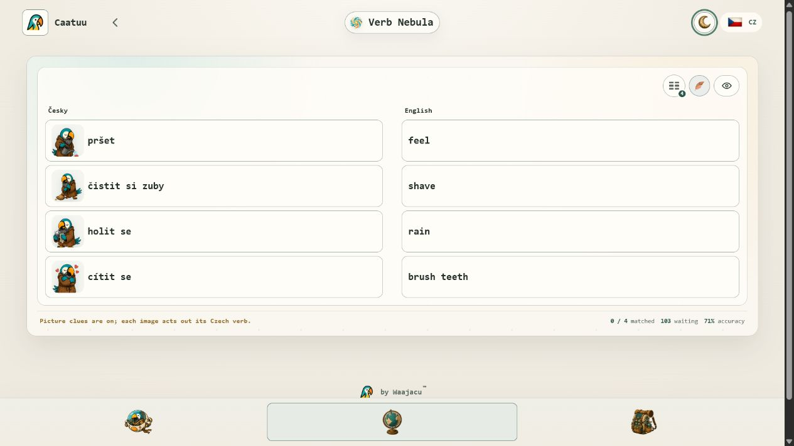
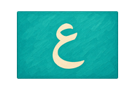

# Caatuu

> **Learn languages. Explore new worlds.**

[](https://github.com/savethebeesandseeds/caatuu/actions/workflows/repository-ci.yml)
[](LICENSE)

Caatuu is a free, open-source language-learning app for guided practice with
words, phrases, translation, and games. Explore illustrated sentences, connect
words to meaning, and practise grammar in a playful world with Caatuu's macaw.

Learning progress and preferences stay on your device. No account is required,
and the app has no advertising or product analytics. Browser courses support
offline practice after their required assets have been downloaded; Android
packages provide the native offline experience for their included courses.

**[Open Caatuu](https://caatuu.waajacu.com/)** ·
[Development guide](docs/DEVELOPMENT.md) · [Privacy notice](docs/PRIVACY.md)



## Language learning should feel alive

Caatuu is designed for curiosity. Discover words in context, connect them to
images and meaning, practise grammar through play, and build familiarity by
returning to places and characters you remember.

- Explore sentences, images, translations, and individual word meanings in
  **Word World**.
- Build vocabulary in **Verb Nebula**, practise conjugation in **Conjugation
  Comet**, and explore agreement in **Grammar Gravity**.
- Use listening practice and device speech where the course supports them.
- Track practice and progress locally, then return to the words and structures
  you want to strengthen.
- Learn in the browser or with the Android app, including offline practice once
  setup is complete.

Games, dictionaries, pronunciation aids, and optional model tools follow each
course's declared capabilities. Every course uses the same application while
retaining its own language, content, and learning goals.

## Inside the experience

<table>
  <tr>
    <td width="50%">
      
    </td>
    <td width="50%">
      
    </td>
  </tr>
  <tr>
    <td align="center"><strong>Word World</strong><br>Explore sentences, images, and meaning.</td>
    <td align="center"><strong>Verb Nebula</strong><br>Learn grammar by making connections.</td>
  </tr>
</table>

## Any language, one universe

One shared application, layout, and game engine serves every course. Language
packs provide their own authored content, adapters, games, and linguistic
features through the [language-app contract](docs/LANGUAGE_APP_CONTRACT.md).
The learner's base language selects the interface; shared English concepts
provide the audit and semantic-search authority.

Eight courses are registered in the browser catalog and enabled for Android
delivery. Five enable Pages delivery; Arabic, Scientific Latin and Georgian
retain local browser previews with public Pages delivery disabled.

| Flag or emblem | Learner language | Learning language | Route | Course status |
| --- | --- | --- | --- | --- |
|  | English | Czech | `/cz/` | Active |
|  | English | Mandarin (Simplified Chinese) | `/zh/` | Development preview |
|  | English | Spanish | `/es/` | Development preview |
|  | Spanish | English (American) | `/es-en/` | Development preview |
|  | English | Norwegian Bokmål | `/nb/` | Development preview |
|  | English | Modern Standard Arabic | `/ar/` | Local development preview |
|  | English | Scientific Latin (Neo-Latin) | `/la/` | Local development preview |
|  | English | Georgian | `/ka/` | Local development preview |

Czech is the active reference course and the course shown in the game
screenshots. Other courses retain their development status and pending reviews;
Pages-enabled previews remain `noindex`. This table describes the current
source checkout. Courses available on the public website or in an installed APK
depend on the version that was published.

The [Norwegian course report](docs/NORWEGIAN_BOKMAL_COURSE_20260909.md) records its
expanded banks, Bokmål conventions, validation, and remaining review. Registering
Norwegian does not add it to an already published APK. The
[Arabic course note](docs/ARABIC_COURSE.md) records its substantial first-course
scope, curriculum licensing and pending language reviews. Arabic joins the
Android course bundle starting with version 179.

The [Scientific Latin course note](docs/LATIN_SCIENTIFIC_COURSE.md)
introduces Scientific Neo-Latin through Word World, vocabulary, conjugation,
and agreement practice, with 2,500 sentences and 600 verb pairs. Qualified
Latinist review remains pending; speech
uses the shared browser/Android device speech provider. Pronunciation
review remains pending; a dedicated listening game is not enabled.

The [Georgian course note](docs/GEORGIAN_COURSE.md) describes its 2,500 sentences,
600 verb-meaning pairs, beginner reading content and explicit verb/case
contexts. The verb count includes practical phrases. Its painted five-cross
flag follows the same visual style as the other course icons. Native Georgian
review remains pending. Audio uses the shared
browser/Android device speech provider and joins the Android course bundle
starting with version 179.

New courses follow the [language-pack guide](tools/language-packs/README.md).
Registration, content review, licensing, and publication remain separate steps.

## Replicate the development environment

Run these commands from the repository root in PowerShell. They create the one
durable local development container directly from a fresh `debian:latest`,
mount this checkout at `/workspace`, and reserve the loopback-only development
address `http://127.0.0.1:8765/`:

```powershell
$caatuuRoot = (Resolve-Path .).Path

docker run --detach --interactive --tty `
  --pull always `
  --name caatuu-dev `
  --hostname caatuu-dev `
  --init `
  --restart no `
  --workdir /workspace `
  --publish 127.0.0.1:8765:9172 `
  --mount "type=bind,source=$caatuuRoot,target=/workspace" `
  --env CAATUU_WORKSPACE_ROOT=/workspace `
  --env BIND_ADDR=0.0.0.0 `
  --env PORT=9172 `
  --env RUST_LOG=info `
  --env ENABLE_ANDROID_DEBUG_DOWNLOADS=0 `
  --env ENABLE_BUG_REPORTS=0 `
  --env ENABLE_CAATUU_GAME_PREVIEW=1 `
  --env DICTIONARY_GAP_STORE_PATH=/workspace/artifacts/dictionary-gaps/czech-missing-words.v1.json `
  --env VIRTUAL_ENV=/opt/caatuu-ml `
  --env JAVA_HOME=/opt/jdk-17 `
  --env ANDROID_SDK_ROOT=/opt/android-sdk `
  --env ANDROID_HOME=/opt/android-sdk `
  --env GRADLE_HOME=/opt/gradle/gradle-8.14.3 `
  --env CARGO_HOME=/root/.cargo `
  --env RUSTUP_HOME=/root/.rustup `
  --env "PATH=/opt/caatuu-ml/bin:/opt/jdk-17/bin:/opt/android-sdk/cmdline-tools/latest/bin:/opt/android-sdk/platform-tools:/opt/gradle/gradle-8.14.3/bin:/root/.cargo/bin:/usr/local/sbin:/usr/local/bin:/usr/sbin:/usr/bin:/sbin:/bin" `
  --env HF_HOME=/workspace/tools/czech-ml/data/models/english-base/hf-cache `
  --env HF_HUB_ENABLE_HF_TRANSFER=1 `
  --env HF_XET_HIGH_PERFORMANCE=1 `
  --env PYTHONUNBUFFERED=1 `
  --env CAATUU_REQUIRE_NVIDIA=0 `
  debian:latest `
  sleep infinity

docker exec --workdir /workspace caatuu-dev bash ./setup.sh
```

`setup.sh` is idempotent, so rerun it whenever its tracked inputs change. The
initial setup installs the development toolchains, including the pinned Android
SDK and Gradle distribution, into the durable container's writable layer. It
intentionally does not build, test, or start Caatuu. The published port remains
idle until the local server is started in a later development step.

For normal use after the container has been created:

```powershell
docker start caatuu-dev
docker exec --interactive --tty --workdir /workspace caatuu-dev bash --login
```

If `docker run` reports that `caatuu-dev` already exists, use `docker start`;
do not replace the existing environment merely to enter it.

Start the local app in that same container:

```powershell
docker exec --interactive --tty --workdir /workspace caatuu-dev `
  bash apps/server/run.sh start --release
```

This builds the locked Rust server and runs it in the foreground. Keep that
terminal open, then visit [http://127.0.0.1:8765/](http://127.0.0.1:8765/).
From another terminal, inspect or stop the existing server with:

```powershell
docker exec --workdir /workspace caatuu-dev bash apps/server/run.sh status
docker exec --workdir /workspace caatuu-dev bash apps/server/run.sh stop
```

Builds, tests, ML work, and Android toolchains stay inside the Linux container.
See the [development guide](docs/DEVELOPMENT.md) for the maintained runtime,
tooling, and release workflows.

## Built openly

Caatuu is an active development preview growing in public. You are welcome to
explore the code, follow its progress, and learn from the project. External
contributions are temporarily paused while the core product and collaboration
process settle; the contribution guide records the current policy.

- [See how Caatuu is designed](docs/ARCHITECTURE.md)
- [Read the language-app vision](docs/LANGUAGE_APP_CONTRACT.md)
- [Set up a development environment](docs/DEVELOPMENT.md)
- [Inspect course content and learning behavior](tools/learning-evaluation/README.md)
- [Read the contribution policy](.github/CONTRIBUTING.md)

First-party software, developer documentation, and Caatuu-authored English,
Mandarin, Spanish-course, Norwegian, Arabic, Latin and Georgian curriculum content are licensed
[`AGPL-3.0-only`](LICENSE). The course license approval does not certify
native-speaker or pronunciation review.
Third-party or separately licensed models, dictionaries, datasets, artwork,
branding, and components may have separate terms; see
[licensing and attribution](docs/LICENSING.md).
