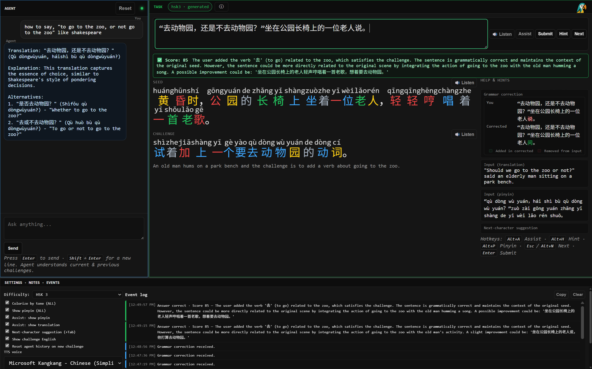

# CAATUU

Chinese learning Web App

Here is how it looks in the browser: 




# Replication instructions

### Start the container
```cmd
docker run --name caatuu --gpus all -it -p 9172:9172 -v $PWD//:/caatuu debian:latest
```

### Instlal everything
```bash
apt-get update
apt-get install -y --no-install-recommends curl
apt-get install -y --no-install-recommends ca-certificates
apt-get install -y --no-install-recommends git
apt-get install -y --no-install-recommends unzip
apt-get install -y --no-install-recommends wget
apt-get install -y --no-install-recommends pkg-config
apt-get install -y --no-install-recommends libssl-dev
apt-get install -y --no-install-recommends build-essential
apt-get install -y --no-install-recommends clang
apt-get install -y --no-install-recommends locales
apt-get install -y --no-install-recommends gpg
```

### Install rust
```bash
curl https://sh.rustup.rs -sSf | sh -s -- -y --default-toolchain stable
source $HOME/.cargo/env
rustc --version
cargo --version
```

### Install ngrok (optional)

```bash
# 2) Add ngrok’s signing key (once)
curl -s https://ngrok-agent.s3.amazonaws.com/ngrok.asc | tee /etc/apt/trusted.gpg.d/ngrok.asc >/dev/null
echo "deb https://ngrok-agent.s3.amazonaws.com bookworm main" > /etc/apt/sources.list.d/ngrok.list
apt-get update
apt-get install -y --no-install-recommends ngrok

nohup ngrok http 9172 --host-header=rewrite > ngrok.log 2>&1 &
curl --silent http://127.0.0.1:4040/api/tunnels
```

### Install Clauflaire (optional)

```
# create keyring path
mkdir -p /usr/share/keyrings

# add the new GPG key (note the NEW path: /cloudflare-main.gpg)
curl -fsSL https://pkg.cloudflare.com/cloudflare-main.gpg -o /usr/share/keyrings/cloudflare-main.gpg

# add the repo (option A: “any” works for most Debian/Ubuntu bases)
echo 'deb [signed-by=/usr/share/keyrings/cloudflare-main.gpg] https://pkg.cloudflare.com/cloudflared any main' > /etc/apt/sources.list.d/cloudflared.list

apt-get update && apt-get install -y cloudflared
```