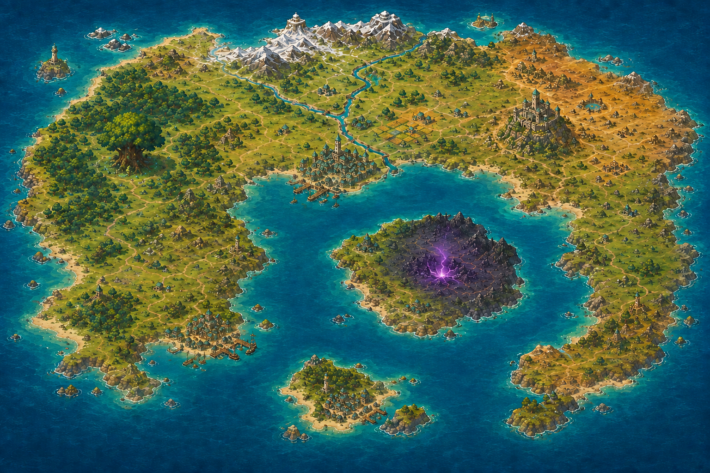

# World map workshop

Development is paused with the macaw adventure. The approved layout and section
plan are preserved; see the [resume guide](../RESUME.md) before expanding it.

The selected world is **The Sheltered Sea**: map B, with one purple source of
dark magic replacing the three temples on its central island. This folder
preserves its layout and the plan for building detailed, adjoining scenery.



The [master image](sheltered-sea/master/layout-v1.png) is the exact selected PNG,
1536 x 1024 pixels. Its hash, coordinate system and provisional section plan
are in [manifest.json](sheltered-sea/manifest.json). The complete map-generation
and correction prompts are in [provenance.json](sheltered-sea/provenance.json).
It is an immutable geography reference; detailed section approval is separate.

## Folder layout

```text
world-map/
  README.md
  sheltered-sea/
    manifest.json
    provenance.json
    master/layout-v1.png
    sections/                 reviewed detailed scenery
    masks/                    reviewed walkable-area masks
    overlays/                 reviewed foreground art
```

Only the selected master, portable records, documentation and future approved
art belong here. The folder is outside the Godot project and is an authoring
source, with no new browser route or runtime integration.

All eight map images generated so far are preserved locally under
`artifacts/games/lab/world-map-concepts/20260906/`, with their prompts and an
archive index. That directory is Git-ignored; it is not a remote backup.

New section work goes under the Git-ignored directory
`artifacts/games/lab/world-map-expansion/sheltered-sea-v1/`:

```text
inputs/<section-id>/           source crops and adjacent reference images
candidates/<section-id>/v001/  generated PNG, prompt and source hashes
reviews/                      joins, registration and character-scale previews
assembled/                    stitched previews and large editing exports
```

Preserve each generation and each manual revision under a new version. Promote
only reviewed results into the curated section, mask or overlay folders. Keep
the master and earlier accepted files intact.

## Recommended production sequence

1. **Establish the drawing scale with two neighbors.** Start around the city
   and its western forest approach. Put the existing macaw into a sample view
   to choose door, tree, path and character sizes. The map fixes the geography;
   detailed art must still establish usable spaces at the playing scale.
2. **Generate from fixed map coordinates.** Give every section its master
   crop, the full layout, the agreed camera/style and any approved neighboring
   art. Do not obtain the next section only by enlarging the last generation;
   that can accumulate changes to the geography.
3. **Keep overlap and review actual joins.** Use the overlapping context to
   match coastlines, riverbanks, roads, vegetation, light and drawing scale.
   Overlay the proposed section on its reference and inspect shared landmarks.
   Generation can move or redraw features even when prompted to preserve them.
   Repair mismatches before approval; overlap does not guarantee seamless art.
4. **Assemble incrementally.** Register approved sections at one shared scale,
   retaining their context pixels. Combine their cores for the large editing
   image, repairing joins where required. Review each new neighbor as it is
   added. The final export dimensions remain undecided until the pilot works.
5. **Paint movement separately.** Once ground art is accepted, draw walkable
   masks in the same coordinate space. Broad clear ground can be walkable;
   roads are visual guides. Keep the masks editable and separate from the art.
6. **Add foreground art and actors.** Paint the tree canopies, roofs or other
   pieces the macaw should pass behind as separate overlays. NPCs, doors and
   other objects that change state should be independently placed assets.

The game should eventually load nearby image sections. A large stitched image
is useful for painting, review and export, while smaller textures give control
over loading and memory. Godot's [image-import guidance](https://docs.godotengine.org/en/stable/tutorials/assets_pipeline/importing_images.html)
explains that textures consume video memory and that platform texture-size
limits need consideration. This is the reason for retaining the sections even
when we create a whole-map export; streaming is not implemented here yet.

## Coordinates and first section plan

The origin is the master image's top-left corner. X increases to the right and
Y downward. All rectangles use `[x, y, width, height]`, with the right and
bottom edges excluded. Image positions, movement masks and later object
placements must all refer back to that same map coordinate system.

The manifest proposes a first regional pass of six 512 x 512 core sections,
three columns by two rows. Each gets up to 64 master pixels of context on
every side, clipped at the master boundary. Neighboring context images
therefore share 128 pixels. The context origin is recorded separately from
the core origin so trimming cannot accidentally shift a section.

This grid is a planning aid. It can be subdivided after the pilot establishes
the required detail. There are no generated or approved detailed sections yet.
The initial pilot pair, `r00-c01` and `r00-c00`, contains the city and its western
approach and shares a land boundary for a useful continuity check.

Every future approved section record needs:

- its ID, master version/hash, core and context rectangles;
- pixel dimensions and the agreed pixels-per-master-pixel scale;
- versioned file, SHA-256, source references and exact generation/edit prompts;
- approval status and the registration/seam review result.

At scale 4, a 512-pixel core becomes 2048 pixels and a 64-pixel context margin
becomes 256 pixels; the full map would be 6144 x 4096. This is an example, not
the final gameplay resolution. The manifest deliberately leaves the scale
and composite dimensions unset.

Do not stretch this 3:2 master into a globe texture. A future globe projection
will be a separate derivative of the approved geography.

## Saving and validation

Use the canonical checkout on `main`. Keep candidate generation and any image
processing in the established workflows; run image utilities in the existing
Tukevejtso container. This setup copied the selected master without resizing,
recompression or pixel changes and verified its SHA-256.

Before committing approved source or documentation, run the repository checks
in the existing development container:

```powershell
docker exec -w /workspace caatuu-dev node tools/repository/check-tracked-files.mjs
docker exec -w /workspace caatuu-dev node tools/repository/check-markdown-links.mjs
```

Commit only this task's reviewed paths. Candidate and assembled-output archives
remain local; a Git commit or push does not back them up.
