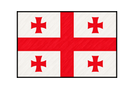

# English → Modern Standard Georgian

The finite first course is a local browser development preview at
[`/ka/`](http://127.0.0.1:8765/ka/). It teaches the Georgian language of Georgia,
labelled **ქართული**, through the existing shared application and game engines.
The learner base and interface are English. The course ID is `ka`, the script
is `Geor`, and its own storage/cache namespaces start with `caatuu-ka`.

## What to learn first

Begin with Mkhedruli recognition and first conversations, then use everyday
sentences and the present-tense conjugation boards. The course includes all 33
modern letters, greetings, polite requests, introductions, numbers, transport,
accommodation, food, shopping, directions and asking for help. Letter names in
word hints identify the letters; they do not supply approved pronunciation.

Use [TSU's Georgian eLearning course](https://ice.tsu.ge/web/elearning_geo.html)
for its alphabet and sound lessons alongside this text-first preview. Its
beginner sequence informed the topic selection; its lessons, audio and exercise
banks were not copied into Caatuu. [GeoFL](https://www.geofl.ge/) is a further
Georgian teaching reference with reading, grammar and listening resources.

Learn whole expressions before trying to infer every verb form. For example:

| Meaning | Georgian | Contrast |
| --- | --- | --- |
| I have a book. | წიგნი მაქვს. | Inanimate possession |
| I have a brother. | ძმა მყავს. | Animate possession |
| The teacher is writing a letter. | მასწავლებელი წერილს წერს. | Nominative subject; dative object |
| The teacher wrote a letter. | მასწავლებელმა წერილი დაწერა. | Ergative subject; nominative object |
| The teacher came. | მასწავლებელი მოვიდა. | This intransitive past keeps a nominative subject |
| We need two tickets. | ორი ბილეთი გვჭირდება. | Singular noun form after the numeral |
| I know the answer. | პასუხი ვიცი. | Exceptional nominative object with ვიცი |
| He/she knows Georgian. | მან იცის ქართული. | Exceptional ergative subject even in the present |
| I work as a teacher. | მასწავლებლად ვმუშაობ. | Adverbial case expressing a role |
| Friend, help me! | მეგობარო, დამეხმარე! | Vocative address; informal request |

Object agreement and case depend on the verb and screeve. The
[Georgian morphology study](https://arxiv.org/abs/2203.08527) explains why one
suffix recipe or a subject-only paradigm cannot describe the entire system.
The course therefore supplies explicit forms with a fixed object or setting;
it is not an exhaustive conjugator.

## Authored scope and counting

| Bank | Included units |
| --- | ---: |
| Word World | 2,500 sentences |
| Verb Nebula | 600 distinct verb-meaning pairs |
| Conjugation Comet | 21 lexemes; 53 six-person paradigms; 318 forms |
| Grammar Gravity | 12 agreement families; 240 examples |
| Noun practice | 150 nominative singular/plural forms |

The sentence bank contains **107 fixed examples**, including 33 letter
recognition sentences, 67 practical expressions and seven case foundations,
plus **120 authored frames over six constrained lexical sets of 20 entries**.
Seven weak frame realizations were replaced by the case foundations; the other
2,393 frame realizations include reviewed exceptions for their actual nouns.
It is bounded, original authoring with explicit
inflected forms, rather than 2,500 independently written passages or runtime
generation. Word hints explain attached case and postposition forms in context.

Sentence badge levels contain 1,305 introductory, 955 intermediate and 240
more complex examples. Difficulty, usefulness and complexity are author-assigned
practice metadata; they do not establish CEFR attainment or measured learning
outcomes. The intermediate material introduces present/future/past contrasts,
possession, experiencers and case. Connected examples include conditions,
reasons, relative clauses and temporal clauses. This is a first course, not
complete Georgian grammar or a full reading/listening curriculum.

The 600 verb pairs comprise **200 selected headword entries and 400 contextual
verb phrases**. There are 186 single-word targets and 414 multiword targets
because some headword meanings are naturally verbal expressions. Targets use
masdars (verbal nouns) or explicitly meaningful expressions, not invented
English-style infinitives. These counts do **not** mean 600 independent verb
roots. Every target and English meaning is distinct within the matching bank.

Sixteen conjugation lexemes have present, future and completed-past boards.
Four possession/experiencer verbs and exceptional **ცოდნა** (know) have present
boards only. The third-person
pronouns distinguish nominative, ergative and dative subjects where appropriate;
the example fixes the object, its number and its case. No perfect-series,
complete imperative, or exhaustive multi-object paradigm is claimed.

Agreement journeys use **human subjects and verb number**. Noun practice
classifies singular and plural forms. The content explicitly avoids assigning
grammatical genders and explains that nonhuman plurals and nouns following
numerals need separate agreement treatment.

## Games and language behavior

Enabled: Word World, Verb Nebula, Conjugation Comet and Grammar Gravity. Case
Cosmos stays disabled: its current engine explicitly accepts only English →
Czech, validates Latin-script nouns, and hard-codes Czech cases including
accusative and locative. Georgian needs a different inventory with ergative and
adverbial cases. Turning on that engine would teach incorrect categories.
Georgian's seven cases are introduced in contextual Word World examples and
sentence hints; conjugation contexts show the relevant subject/object cases.
Naturalization Nucleus is not an alphabet trainer for Georgian, and Memory Moon
is not implemented. Sounds Quasar and speech recognition remain disabled.
Speech uses the shared browser/Android device speech provider. Playback depends
on the device's Georgian support; pronunciation review remains pending.

The adapter displays left-to-right Mkhedruli and keeps case endings and
postpositions attached to their orthographic words. It folds Mtavruli headings
to Mkhedruli during search and assessment while retaining distinctions such as
კ/ქ, ტ/თ, პ/ფ, წ/ც and ჭ/ჩ. The
[W3C case-conversion reference](https://w3c.github.io/i18n-tests/results/case-conversion)
documents the modern Mkhedruli/Mtavruli pairing. Authored teaching sentences
remain in Mkhedruli. Target text never enters the English embedding model.

## Course flag

The course flag uses the white-and-red five-cross composition described by
[Georgia's heraldry department](https://heraldika.ge/index.php?arms_id=838&lng=eng&m=85):
a central cross reaching all four edges and four smaller Bolnisi-style crosses
with curved sides and flared ends. The painted texture matches Caatuu's other
course flags; the visible rectangle has a 3:2 proportion.

The normalized artwork is a 192 × 128 RGBA PNG with a 144 × 96 flag centered
inside transparent padding. Identical copies live in the shared runtime and
launcher icon catalogs. The existing `georgian_flag.svg` delivery URL embeds
those same PNG bytes, so the browser and offline package receive one complete
asset without an extra image request. The README uses the PNG directly.

A 1.5px black outline sits inside the flag face so its white edges remain
visible on light backgrounds. Offline updates fetch fresh artwork instead of
copying an older HTTP-cache entry into the new course cache.

Generated sources, the built-in imagegen prompts and the normalization script
are retained under ignored `artifacts/imagegen/georgian-flag-20261004/`.
The flag update introduced Georgian offline cache revision `caatuu-ka-pwa-v5`.
Later shared-asset updates advance the current revision declared in
[`setup-assets.json`](../apps/languages/georgian/static/setup-assets.json).

The 4 October 2026 artwork update verified five distinct red crosses, transparent
padding, identical catalog copies and the SVG's embedded PNG bytes. All eight
browser setup catalogs and generated course views are current. Eleven focused
generated-view and static asset-boundary tests passed, along with repository
file and Markdown link checks. Browser review confirmed the flag on Georgian
Home and its current-course card, with local setup reporting Ready.

## Review and delivery

This is AI-authored content with an author self-review. **Independent native
Georgian review is pending**, including naturalness, translations, verb forms,
case selection and the learning sequence. Automated playability and inventory
checks cannot approve those linguistic judgments. Pronunciation and audio are
not approved. Distribution licensing is cleared under AGPL-3.0-only by the
[4 October owner approval](CURRICULUM_LICENSE_APPROVAL_20261004.json).

Browser and Android delivery are enabled. Public Pages delivery remains
disabled. The eight-course version 179 bundle uses the Android source allowlist,
shared English embedding provider and standard device-speech declaration.
The original course onboarding did not build or publish an APK;
physical-device checks remain separate from release publication.

The authoritative sentence source is
[`content.json`](../apps/languages/georgian/content/word-world/content.json).
The shared build tool derives publication and runtime views from that one file.
Registration lives in [`course.json`](../apps/languages/georgian/course.json).
No language-specific UI, sampling policy or learner-state fork was added.

## Verification

The second content review corrected **233 sentence records, 14 verb pairs and
two noun forms**, and added the six-person present board for **know**. It fixed
the nominative object of ვიცი, replaced unnatural combinations such as buying
a passport, a table on a table and an open/closed city, and clarified cooking,
driving, tidying, number versus reference number, and cinema-building meanings.
It corrected the distinction between dividing into syllables and spelling out,
and uses a verbal expression for asking a question.

Grammar and vocabulary distinctions were cross-checked against
[Makharoblidze's Basic Georgian](https://eprints.iliauni.edu.ge/3035/),
[the dictionary's adverbial-role example](https://dictionary.ge/ka/word/as%2BIII/),
[its cinema entry](https://dictionary.ge/ka/word/cinema/), and
[the syllable lesson](https://ena.ge/elearning/6/____qrammatika.html).
These checks are an author review, not independent native certification.

- 13 focused Georgian and sentence-source tests passed after the corrections.
- Evaluator C reports **3,897 authored records and 3,808 playable units** with
  no missing/invalid usefulness or complexity, no rejected English inputs, and
  no duplicate sentence or verb pairs within their banks. The 20 exact English
  overlaps between games are deliberate shared meanings. Structural records
  still have no independent learner unit or English text.
- The second report and exact source hashes are retained under ignored
  `artifacts/learning-evaluation/content/ka-second-review-20261004/`;
  before/after corrections are in
  `artifacts/language-content/georgian-onboarding/review-changes.json`.
- Generated course views and sentence projections match their authorities.
  The browser displays the four enabled game choices, all six conjugation
  rows, and the revised Word World bank with **1,305 eligible introductory
  sentences** and contextual Mkhedruli hints. The walkthrough submitted no
  answers and left the existing 0 XP / seven Georgian rounds unchanged.

Initial onboarding checks, before the second content review:

- 88 tests passed: 21 Georgian, Arabic, Latin and shared sentence-source tests,
  19 Verb Nebula regressions and 48 course-contract/generated-view tests.
- Independent evaluator C traversed the full Georgian metadata inventory:
  3,890 authored records and **3,802 playable units**. Structural paradigms,
  agreement families and forms are not counted as independent learning units.
  Its findings distinguish those records rather than inflating the playable
  total. No missing/invalid usefulness or complexity values were reported.
- English semantic model evaluation was not run. Counts and metadata checks do
  not verify Georgian translation accuracy.
- The retained report is under ignored
  `artifacts/learning-evaluation/content/ka-first-course-20261004/`.

- All eight browser setup catalogs have current artifact hashes; generated
  browser views and the Georgian sentence projections match their sources.
- Browser checks confirmed Georgian Home, Word World word hints, Verb Nebula,
  all six conjugation rows and the agreement journey. Mkhedruli rendered clearly.
  The local offline package updated successfully and reports Ready.
- The walkthrough found and fixed a shared Verb Nebula speech-capability leak.
  A speech-disabled course now hides its audio menu and cannot invoke the voice
  provider, including when an old saved preference says speech is on.
- Timed browser checks left seven unanswered rounds in the local Georgian
  profile, with 0 XP and seven additional local coins. No answers were submitted
  and no existing learning data was cleared.
- Markdown links, repository file policy and whitespace checks passed. The only
  checkout and branch remained canonical `C:\Work\caatuu` on `main`; no commit,
  push, public deployment or APK build was performed.
